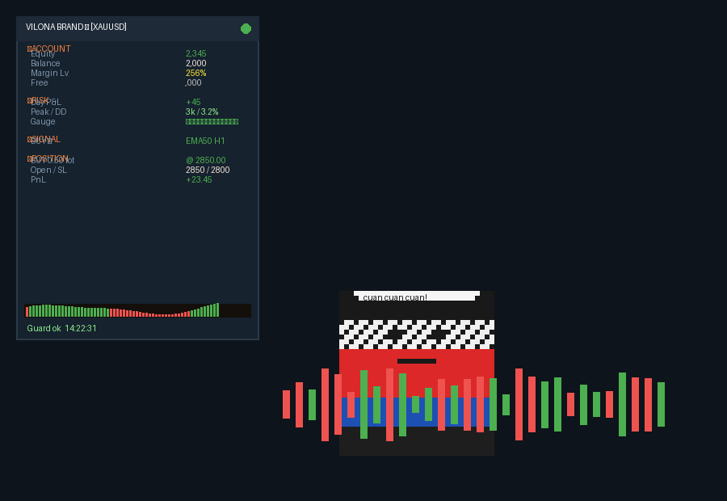

# Vilona Brand HUD + Pet

**Signature trading dashboard for MetaTrader 5** -- premium HUD panel with real-time equity/balance/margin/sparkline + animated Prabowo pixel pet with chat bubbles.

---

## What's Included

| File | Description |
|------|-------------|
| `Vilona_Brand_HUD.ex5` | Compiled EA (standalone, no trading logic) |
| `Vilona_Brand_HUD.mq5` | Open source MQL5 code (feel free to inspect) |
| `sounds/entry.wav` | Entry alert tone (880Hz -> 1320Hz ding) |
| `sounds/exit.wav` | Exit alert tone (660Hz -> 440Hz ding) |
| `screenshot.png` | HUD + pet live on a gold chart |

## Features

- **Real-time HUD Panel**: equity, balance, margin, free margin, equity %, floating P&L, current signal, spread, position size, daily change
- **Equity Sparkline**: mini live chart of your equity curve, updates each tick
- **Pet Animation**: Prabowo pixel pet walks across your chart, bounces off edges, enters/exits are personalized with chat bubbles
- **Position Tracking**: entry price, SL, TP, profit per position displayed live
- **Alert Sounds**: WAV notifications for opens, partial TPs, stop losses, margin warnings
- **Zero Interference**: attaches to ANY chart alongside your existing strategy EA -- no trading logic, no interference

## Install

### Windows

1. Run `install.bat` as Administrator (or double-click)
2. Restart MetaTrader 5
3. Right-click Navigator -> Refresh
4. Drag **Vilona_Brand_HUD** onto any chart

The script copies the EA to `%USERPROFILE%\AppData\Roaming\MetaQuotes\Terminal\*\MQL5\Experts\`.

### Linux / Wine

```bash
chmod +x install.sh
./install.sh
```

### Manual Install

1. Open MT5 -> File -> Open Data Folder
2. Navigate to `MQL5/Experts/`
3. Copy `Vilona_Brand_HUD.ex5` there
4. Restart MT5

### Sound Files

The EA expects specific filenames in `MQL5/Files/`:
- Copy `sounds/entry.wav` -> `MQL5/Files/tgdh_open.wav` (position opened)
- Copy `sounds/entry.wav` -> `MQL5/Files/tgdh_tp.wav` (partial TP banked)
- Copy `sounds/exit.wav` -> `MQL5/Files/tgdh_sl.wav` (stop loss hit)
- Copy `sounds/exit.wav` -> `MQL5/Files/tgdh_profit.wav` (profit close)

## Configuration

After attaching the EA to a chart, set these parameters:

| Parameter | Value | Description |
|-----------|-------|-------------|
| **InpBrandHUDOnly** | `true` | REQUIRED -- disables trading, HUD-only mode |
| **InpPetEnabled** | `true` | Show the animated Prabowo pet |
| **InpSoundEnabled** | `true` | Play WAV alerts on trade events |

All other parameters are for the underlying strategy engine and are ignored in HUD-only mode.

---

## Price

**Rp 50.000 / $3**

Contact to purchase or for the full Vilona trading strategy:

- Telegram: @codergaboets
- WhatsApp: +6285732740006

---

## How It Works

The EA uses only account/position API calls and its own EMA handle -- no trading logic, no strategy interference. It can be attached to any chart regardless of what other EAs are running. The HUD panel sits at the top-left of the chart (Y=48 to avoid overlapping MT5's built-in price display).

The pet cycles through idle sprite frames, walks across the chart, and when a position is opened/closed a chat bubble appears with a relevant message.

---

## Screenshot



*Note: screenshot shows the HUD panel and Prabowo pet on a live XAUUSD chart.*